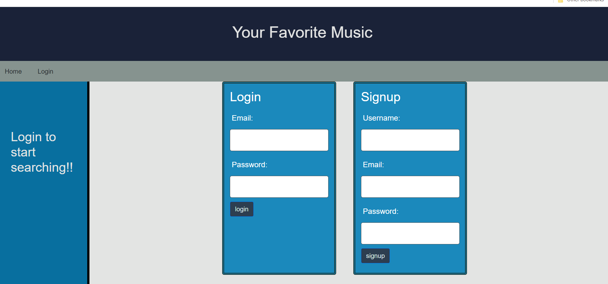
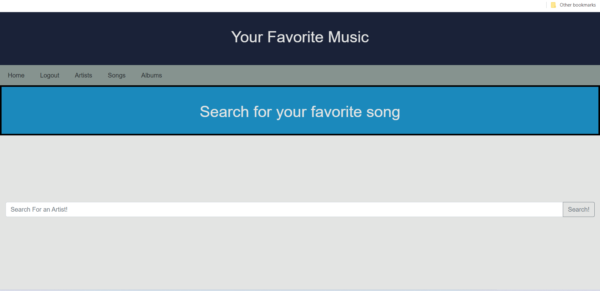
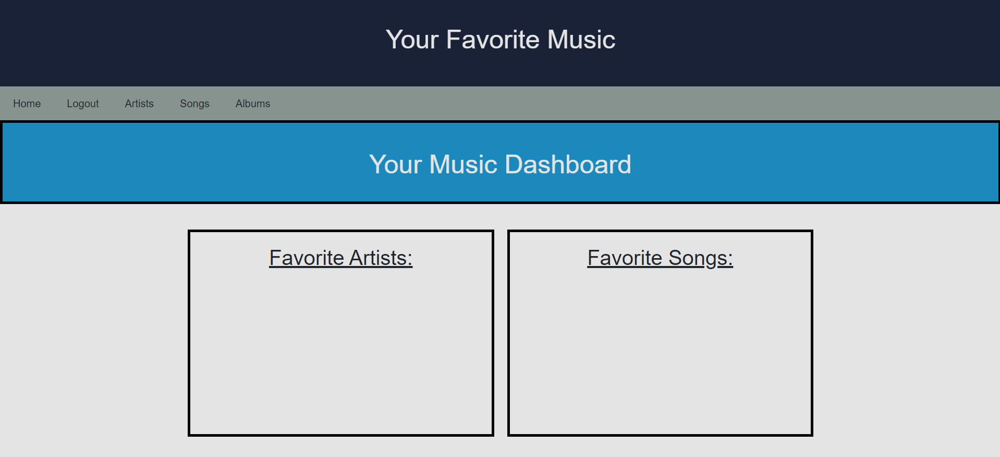

<h1 align="center"> 
Favorite Music App &#153
</h1>

&nbsp;

<h3 align="center">
Welcome to your Favorite Band Music APP!!!
</h3>

&nbsp;

### Table of Content

- [User Story](#user-story)
- [Description](#Description)
- [Technology](#Technology)
- [Links](#Links)
- [Credits](#credits)
- [Acknowledgments](#Acknowledgments)
- [License](#license)

# User Story

    - AS A Music Enthusiast and Avid Blogger
    - I WANT an app to Display Music and Allow Me to Post What I like.
    - SO THAT I Can Display What Artist I Like And Music.

&nbsp;

# Description

&nbsp;

 When the user opens the deployed app they are greeted with a sign up/login page for the user to create an account. On the navigation bar, the user has the options to search a specific artist, album or song of their choice. Once the search has been populated the user has the option to add that to their personal dashboard. On the dashboard for each profile, the added searches are saved as the users favorite, whether its an artist album or both.

 When the user opens the deployed app they are greeted with a sign up/login page for the user to create an account. Afterwards the pages are for the user to go ahead and add music and artist they like.

  
  

&nbsp;

 

&nbsp;

Next the User will be greeted with an area of the app that will allow them to search for artist, songs, and albums.
 
 

 

&nbsp;

This area of our page is our user dashbaord. The dashboard will show the user's favorite artists and songs!
 
 
 

# Technology

   

&nbsp;

&nbsp;

The Site Uses Two Frameworks and One API For Data and They Are:

 

&nbsp;

Bulma:
https://bulma.io/
 

&nbsp;

Bootstrap:
https://getbootstrap.com/
 

&nbsp;

Audiodb:

https://bulma.io/
 

&nbsp;

https://getbootstrap.com/
 

&nbsp;

https://theaudiodb.com

&nbsp;

# Links 

&nbsp;

https://github.com/AlecSchro13/FavoriteBand-Project2

&nbsp;

# Credits

| Omar Orrantia                                                                                                                       |  Parker Riddle                                                                                                                          |                                                               Alec Schroetlin                                                               |                                                                                                                             Dylan Macres |
| :----------------------------------------------------------------------------------------------------------------------------------- | :-------------------------------------------------------------------------------------------------------------------------------------: | :---------------------------------------------------------------------------------------------------------------------------------------: | ---------------------------------------------------------------------------------------------------------------------------------------: |
|  |  |  |  |

&nbsp;

# Acknowledgments

Dan Kaltenbaugh (Instructor) 
Kirtley Adams (Teaching Assistant)  

Kirtley Adams (Teaching Assistant)  
Dan Kaltenbaugh (Instructor) 

George Yoo (Teaching Assisstant)

# License

